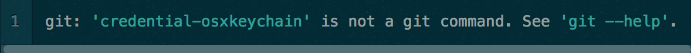
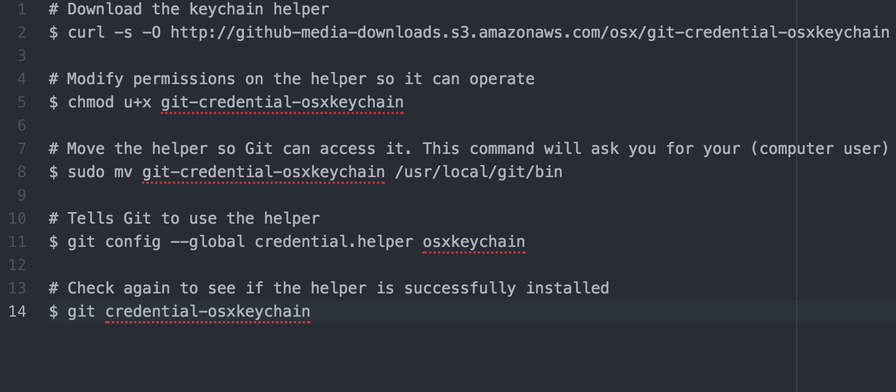

# Github-Tutorial

##What is GitHub?

GitHub is a code hosting platform for version control and collaboration. It lets you and others work together on projects from anywhere.

This tutorial teaches you GitHub essentials like repositories, branches, commits, and Pull Requests. You’ll create your own Hello World repository and learn GitHub’s Pull Request workflow, a popular way to create and review code.

###Getting started

This tutorial assumes you’re using a Mac running at least OS X 10.7. If you are unsure of what OS you have, go up to the top left of your screen, click the Apple menu, and select “About This Mac.”

You’ll also need to ensure that your user account on your computer has admin privileges and that you know your account’s password.

###Setup Github

To save time in the future, we’ll install a utility that will allow your computer to authenticate with Github automatically instead of having to enter your username/password during each session.

First, check if the helper is installed by typing git credential-osxkeychain into the terminal.

If the helper is installed, the terminal will give you instructions on how to use it:

If see the above message, you are now able to access Git repositories using the HTTPS method. There’s a very good chance that this is the only method you will need to access repositories and you can move on to my final notes.

If you don’t have the keychain helper already installed, you’ll see this instead:

To install the keychain helper, execute the following commands:

Once again, if the helper has been installed successfully, the terminal will give you instructions on how to use it:

If see the above message, you are now able to access Git repositories using the HTTPS method. There’s a very good chance that this is the only method you will need to access repositories and you can move on to my final notes.

If you don’t see the above message, you hit a snag along the way. Try going through the keychain helper install steps again.

Otherwise, if you have a specific reason that you need to access Git repositories using SSH, proceed to SSH Keys.

